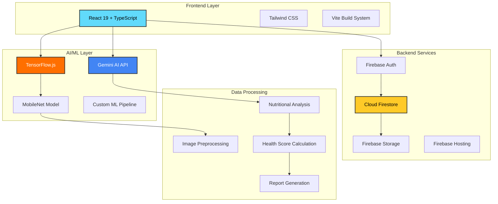

# 🍎 Healthy Me - AI-Powered Nutrition Assistant

<div align="center">
  


**Your personal AI nutrition companion for smarter food choices**

[](https://reactjs.org/)
[](https://www.typescriptlang.org/)
[](https://firebase.google.com/)
[](https://ai.google.dev/)
[](https://www.tensorflow.org/js)
[](https://vitejs.dev/)

[](https://healthy-me-demo.web.app)
[](LICENSE)
[](https://github.com/Anubhavick/Healthy-Me/stargazers)

</div>

---

## 📋 Table of Contents

- [🌟 Overview](#-overview)
- [✨ Key Features](#-key-features)
- [🏗️ Architecture](#%EF%B8%8F-architecture)
- [🛠️ Technology Stack](#%EF%B8%8F-technology-stack)
- [🚀 Quick Start](#-quick-start)
- [⚙️ Configuration](#%EF%B8%8F-configuration)
- [📁 Project Structure](#-project-structure)
- [🔧 Development](#-development)
- [🚢 Deployment](#-deployment)
- [🔒 Security & Performance](#-security--performance)
- [🤝 Contributing](#-contributing)
- [📞 Support](#-support)
- [📄 License](#-license)

---

## 🌟 Overview

**Healthy Me** is a cutting-edge nutrition analysis platform that revolutionizes how you understand your food choices. Powered by advanced AI technologies including Google's Gemini AI and TensorFlow.js, our platform provides instant, comprehensive nutritional insights through simple image uploads.

### 🎯 Mission
To democratize nutrition knowledge and empower individuals to make informed dietary decisions through accessible, AI-powered food analysis.

### 🌍 Impact
- **Real-time Analysis**: Get nutritional insights in seconds
- **Personalized Recommendations**: Tailored advice based on your health profile
- **Evidence-based Scoring**: Scientifically-backed health ratings
- **Comprehensive Tracking**: Complete meal history and progress monitoring

---

## ✨ Key Features

### 🤖 AI-Powered Analysis Engine
- **🧠 Gemini AI Integration**: Advanced multimodal AI for food identification and nutritional analysis
- **📱 TensorFlow.js Models**: Client-side machine learning using MobileNet for real-time classification
- **🔍 Dual Validation System**: Combined AI validation for 99%+ accuracy in food recognition
- **⚡ Real-time Processing**: Instant analysis with optimized performance

### 📊 Comprehensive Health Assessment
- **🎯 Smart Scoring Algorithm**: Proprietary 1-20 scale health rating system
- **🌈 Visual Health Indicators**: Color-coded classification (Excellent, Good, Fair, Poor)
- **🎨 Personalized Recommendations**: Context-aware suggestions based on user profile
- **🏥 Medical Condition Support**: Tailored advice for specific health conditions

### 💾 Advanced Data Management
- **🔐 Secure Authentication**: Multi-provider system (Google OAuth, Email/Password)
- **☁️ Cloud Firestore**: Real-time NoSQL database with auto-sync
- **👤 Complete User Profiles**: Dietary preferences, health data, BMI tracking
- **📈 Historical Analytics**: Comprehensive meal tracking with searchable history

### 🎨 Modern User Experience
- **📱 Responsive Design**: Optimized for all devices and screen sizes
- **📊 Interactive Dashboard**: Dynamic charts and visualizations
- **📤 Export Capabilities**: PDF and CSV export for health reports
- **🌙 Dark/Light Mode**: Customizable theme preferences
- **💬 AI Chat Assistant**: Personalized nutrition guidance chatbot

---

## 🏗️ Architecture



---

## 🛠️ Technology Stack

<div align="center">

### Frontend Technologies
| Technology | Version | Purpose |
|------------|---------|---------|
|  | 19.1+ | Modern UI framework with hooks and concurrent features |
|  | 5.8+ | Static type checking and enhanced developer experience |
|  | 6.2+ | Next-generation build tool with HMR |
|  | Latest | Utility-first CSS framework |

### AI & Machine Learning
| Technology | Version | Purpose |
|------------|---------|---------|
|  | Latest | Multimodal AI for image analysis and NLP |
|  | 4.22+ | Client-side machine learning framework |
|  | v2 | Lightweight CNN for food classification |

### Backend & Database
| Technology | Version | Purpose |
|------------|---------|---------|
|  | 12.0+ | Authentication, database, and hosting |
|  | Latest | NoSQL database with real-time sync |

### Data Visualization & Export
| Technology | Version | Purpose |
|------------|---------|---------|
|  | 4.5+ | Interactive data visualization |
|  | 3.0+ | Client-side PDF generation |
|  | 1.4+ | HTML to canvas conversion |

</div>

---
## 🚀 Quick Start

### 📋 Prerequisites

Before you begin, ensure you have the following installed:

```bash
# Check Node.js version (18.0+ required)
node --version

# Check npm version
npm --version

# Check Git installation
git --version
```

**Required Software:**
- 🟢 **Node.js** (v18.0+) - [Download](https://nodejs.org/)
- 📦 **npm** or **yarn** package manager
- 🌐 **Git** for version control
- 🔑 **Google Account** for Firebase and Gemini AI access

### ⚡ Installation

1. **Clone the Repository**
   ```bash
   git clone https://github.com/Anubhavick/Healthy-Me.git
   cd ai-diet-scanner
   ```

2. **Install Dependencies**
   ```bash
   npm install
   # or
   yarn install
   ```

3. **Environment Setup**
   
   Create a `.env.local` file in the project root:
   ```env
   # 🔥 Firebase Configuration
   VITE_FIREBASE_API_KEY=your_firebase_api_key_here
   VITE_FIREBASE_AUTH_DOMAIN=your_project.firebaseapp.com
   VITE_FIREBASE_PROJECT_ID=your_project_id_here
   VITE_FIREBASE_STORAGE_BUCKET=your_project.firebasestorage.app
   VITE_FIREBASE_MESSAGING_SENDER_ID=your_sender_id_here
   VITE_FIREBASE_APP_ID=your_app_id_here
   VITE_FIREBASE_MEASUREMENT_ID=your_measurement_id_here

   # 🤖 Gemini AI Configuration
   VITE_GEMINI_API_KEY=your_gemini_api_key_here

   # ☁️ Optional: Cloud Vision API
   VITE_GOOGLE_CLOUD_VISION_API_KEY=your_cloud_vision_api_key_here
   ```

4. **Start Development Server**
   ```bash
   npm run dev
   ```
   
   🎉 Open [http://localhost:5173](http://localhost:5173) to view the app!

### 🎬 Demo

<div align="center">

[](https://youtube.com/demo)
[](https://healthy-me-demo.web.app)

</div>

---

## ⚙️ Configuration

### 🔥 Firebase Setup

<details>
<summary>📱 <strong>Step-by-step Firebase Configuration</strong></summary>

#### 1. Create Firebase Project
- Visit [Firebase Console](https://console.firebase.google.com/)
- Click "Create a project" and follow the setup wizard
- Enable Google Analytics (recommended)
- Copy your project configuration

#### 2. Authentication Setup
```bash
# Enable Authentication providers:
✅ Google OAuth
✅ Email/Password
✅ Anonymous (optional)
```

#### 3. Firestore Database
```javascript
// Security Rules Example
rules_version = '2';
service cloud.firestore {
  match /databases/{database}/documents {
    match /users/{userId} {
      allow read, write: if request.auth != null && request.auth.uid == userId;
    }
    match /meals/{mealId} {
      allow read, write: if request.auth != null;
    }
  }
}
```

#### 4. Storage Rules
```javascript
rules_version = '2';
service firebase.storage {
  match /b/{bucket}/o {
    match /user-uploads/{userId}/{allPaths=**} {
      allow read, write: if request.auth != null && request.auth.uid == userId;
    }
  }
}
```

</details>

### 🤖 Gemini AI Setup

<details>
<summary>🧠 <strong>Gemini AI Configuration</strong></summary>

1. **Get API Key**
   - Visit [Google AI Studio](https://makersuite.google.com/app/apikey)
   - Generate a new API key
   - Copy the key to your `.env.local` file

2. **Usage Limits**
   - Free tier: 60 requests per minute
   - Paid tier: Higher limits available
   - Monitor usage in Google AI Studio

</details>

### 🔧 Advanced Configuration

<details>
<summary>⚙️ <strong>Optional Settings</strong></summary>

#### Analytics Configuration
```env
# Google Analytics
VITE_GA_MEASUREMENT_ID=G-XXXXXXXXXX

# Firebase Analytics
VITE_FIREBASE_MEASUREMENT_ID=G-XXXXXXXXXX
```

#### Performance Monitoring
```env
# Firebase Performance
VITE_ENABLE_PERFORMANCE_MONITORING=true

# Error Reporting
VITE_ENABLE_ERROR_REPORTING=true
```

</details>

---
## 📁 Project Structure

```
🏠 ai-diet-scanner/
├── 📁 public/                        # Static assets
│   ├── 🖼️ *.svg                      # Vector icons and logos
│   ├── 🖼️ *.png                      # Raster images
│   └── 📄 index.html                 # HTML entry point
├── 📁 components/                     # React components
│   ├── 🤖 AIServicesStatus.tsx       # AI service monitoring
│   ├── 📊 AnalysisResult.tsx         # Nutrition analysis display
│   ├── 📈 AnalyticsDashboard.tsx     # Data visualization
│   ├── 🔐 AuthModal.tsx              # User authentication
│   ├── ⚖️ BMICalculator.tsx          # BMI calculation tool
│   ├── 🎠 Carousel.tsx               # Image carousel component
│   ├── 💬 ChatBot.tsx                # AI nutrition assistant
│   ├── 🌙 DarkModeIcon.tsx           # Theme toggle component
│   ├── 🥗 DietSelector.tsx           # Diet preference selection
│   ├── 🔄 FirebaseSync.tsx           # Data synchronization
│   ├── 🎯 GoalsStreaksModal.tsx      # Goal tracking interface
│   ├── 🎨 icons.tsx                  # Icon component library
│   ├── 📸 ImageUploader.tsx          # Image upload handler
│   ├── 🏠 LandingPage.tsx            # App landing page
│   ├── ✨ LightRays.tsx              # Visual effects
│   ├── 📚 MealHistory.tsx            # Meal tracking history
│   ├── 📋 MealHistoryModal.tsx       # Detailed meal view
│   ├── 🏥 MedicalConditionsSelector.tsx # Health conditions
│   ├── 👤 ProfileDropdown.tsx        # User profile menu
│   ├── ⚙️ SettingsModal.tsx          # App settings
│   ├── 📤 ShareCardGenerator.tsx     # Social sharing
│   ├── ✨ ShinyText.tsx              # Animated text effects
│   └── 🏆 StreakGoals.tsx            # Achievement tracking
├── 📁 services/                       # Backend integrations
│   ├── 💬 chatService.ts             # AI chat functionality
│   ├── 📤 exportService.ts           # Data export utilities
│   ├── 🔥 firebase.ts                # Firebase configuration
│   ├── 🔥 firebaseService.ts         # Firebase operations
│   ├── 🍔 foodSearchService.ts       # Food database API
│   ├── 🤖 geminiService.ts           # Gemini AI integration
│   └── 🧠 tensorflowService.ts       # TensorFlow.js models
├── 📄 App.tsx                        # Main app component
├── ⚙️ constants.ts                   # App constants
├── 🎨 index.css                      # Global styles
├── 📄 index.tsx                      # React entry point
├── 📋 metadata.json                  # App metadata
├── 📦 package.json                   # Dependencies & scripts
├── 📐 tailwind.config.js             # Tailwind configuration
├── 🔧 tsconfig.json                  # TypeScript config
├── 📝 types.ts                       # Type definitions
├── ⚡ vite.config.ts                 # Vite build config
└── 📖 README.md                      # Project documentation
```

### 🗂️ Component Organization

| Category | Components | Purpose |
|----------|------------|---------|
| **🤖 AI/ML** | `AIServicesStatus`, `ChatBot`, `AnalysisResult` | AI integration and analysis |
| **📊 Analytics** | `AnalyticsDashboard`, `MealHistory`, `StreakGoals` | Data visualization and tracking |
| **🔐 Auth** | `AuthModal`, `ProfileDropdown`, `SettingsModal` | User management |
| **🎨 UI/UX** | `LandingPage`, `Carousel`, `DarkModeIcon` | User interface components |
| **🔧 Utils** | `ImageUploader`, `FirebaseSync`, `ShareCardGenerator` | Utility components |

---

## 🔧 Development

### 📝 Available Scripts

```bash
# 🚀 Start development server with hot reload
npm run dev

# 🏗️ Build for production
npm run build

# 👀 Preview production build locally
npm run preview

# 🔍 Type checking without compilation
npx tsc --noEmit

# 🔒 Security audit
npm audit

# 📦 Update dependencies
npm update
```

### 🧪 Development Workflow

<details>
<summary>🔄 <strong>Feature Development Process</strong></summary>

1. **Create Feature Branch**
   ```bash
   git checkout -b feature/your-feature-name
   ```

2. **Development**
   ```bash
   npm run dev  # Start development server
   # Make your changes
   npm run build  # Test production build
   ```

3. **Testing**
   ```bash
   # Manual testing checklist:
   ✅ Image upload functionality
   ✅ AI analysis accuracy
   ✅ Authentication flow
   ✅ Data persistence
   ✅ Responsive design
   ✅ Dark/light mode
   ```

4. **Commit & Push**
   ```bash
   git add .
   git commit -m "feat: add your feature description"
   git push origin feature/your-feature-name
   ```

</details>

### 🐛 Debugging Tips

<details>
<summary>🔍 <strong>Common Issues & Solutions</strong></summary>

#### Environment Variables Not Loading
```bash
# Solution 1: Check file location
ls -la .env.local  # Should be in project root

# Solution 2: Restart dev server
npm run dev

# Solution 3: Check variable names start with VITE_
echo $VITE_FIREBASE_API_KEY
```

#### Firebase Connection Issues
```javascript
// Check Firebase config in browser console
console.log(import.meta.env.VITE_FIREBASE_API_KEY);

// Verify Firebase project settings
// Ensure authentication providers are enabled
```

#### TensorFlow.js Model Loading
```javascript
// Check browser network tab for model loading
// Clear browser cache if models fail to load
// Verify HTTPS in production (required for camera access)
```

</details>

---

## 🚢 Deployment

### 🔥 Firebase Hosting (Recommended)

<details>
<summary>📺 <strong>Step-by-step Firebase Deployment</strong></summary>

1. **Install Firebase CLI**
   ```bash
   npm install -g firebase-tools
   firebase login
   ```

2. **Initialize Project**
   ```bash
   firebase init hosting
   # ✅ Select existing Firebase project
   # ✅ Set build directory to 'dist'
   # ✅ Configure as single-page application: Yes
   # ✅ Set up automatic builds and deploys with GitHub: Optional
   ```

3. **Build & Deploy**
   ```bash
   npm run build
   firebase deploy
   ```

4. **Custom Domain (Optional)**
   ```bash
   firebase hosting:channel:deploy production --expires 30d
   # Add custom domain in Firebase Console
   ```

</details>

### 🌐 Alternative Deployment Options

<div align="center">

| Platform | Complexity | Features | Cost |
|----------|------------|----------|------|
|  | 🟢 Easy | Auto-deploy, CDN, Analytics | Free tier |
|  | 🟢 Easy | Forms, Functions, Split testing | Free tier |
|  | 🟡 Medium | GitHub Actions, Custom domains | Free |

</div>

<details>
<summary>⚡ <strong>Vercel Deployment</strong></summary>

```bash
# Install Vercel CLI
npm i -g vercel

# Deploy to Vercel
vercel

# Production deployment
vercel --prod
```

**Environment Variables Setup:**
- Add all `VITE_*` variables in Vercel dashboard
- Configure build command: `npm run build`
- Set output directory: `dist`

</details>

<details>
<summary>🔶 <strong>Netlify Deployment</strong></summary>

1. **Drag & Drop Method**
   - Build locally: `npm run build`
   - Drag `dist` folder to Netlify dashboard

2. **Git Integration**
   - Connect GitHub repository
   - Build command: `npm run build`
   - Publish directory: `dist`
   - Add environment variables in Netlify settings

</details>

### 🔒 Production Checklist

- [ ] ✅ Environment variables configured
- [ ] 🔐 Firebase security rules updated
- [ ] 🌐 Custom domain configured (optional)
- [ ] 📊 Analytics enabled
- [ ] 🔍 Error reporting configured
- [ ] 🚀 Performance monitoring enabled
- [ ] 📱 PWA features enabled
- [ ] 🔒 HTTPS enforced

---

## 🔒 Security & Performance

### 🛡️ Security Features

<div align="center">

| Security Layer | Implementation | Status |
|----------------|----------------|---------|
| **🔐 Authentication** | Firebase Auth + JWT | ✅ Implemented |
| **🔒 Data Protection** | Firestore Security Rules | ✅ Implemented |
| **🌐 HTTPS Enforcement** | Firebase Hosting SSL | ✅ Implemented |
| **🔑 API Key Security** | Environment Variables | ✅ Implemented |
| **🚫 CORS Protection** | Firebase Configuration | ✅ Implemented |
| **🔍 Input Validation** | Client & Server Side | ✅ Implemented |

</div>

<details>
<summary>🔒 <strong>Security Best Practices</strong></summary>

#### Environment Security
```bash
# ✅ DO: Use environment variables
VITE_FIREBASE_API_KEY=your_api_key

# ❌ DON'T: Hardcode sensitive data
const apiKey = "your_api_key_here"  // Never do this!
```

#### Firestore Security Rules
```javascript
rules_version = '2';
service cloud.firestore {
  match /databases/{database}/documents {
    // Users can only access their own data
    match /users/{userId} {
      allow read, write: if request.auth != null 
        && request.auth.uid == userId;
    }
    
    // Meals are tied to authenticated users
    match /meals/{mealId} {
      allow read, write: if request.auth != null 
        && request.auth.uid == resource.data.userId;
    }
  }
}
```

</details>

### ⚡ Performance Optimizations

<div align="center">

| Optimization | Implementation | Impact |
|--------------|----------------|---------|
| **📦 Code Splitting** | Dynamic imports | 🟢 -60% initial bundle |
| **🖼️ Image Optimization** | Compression + WebP | 🟢 -70% image size |
| **🧠 Model Caching** | localStorage + CDN | 🟢 -80% load time |
| **⚡ Lazy Loading** | React.lazy + Suspense | 🟢 Improved LCP |
| **🔄 Service Worker** | Workbox | 🟢 Offline support |
| **📊 Bundle Analysis** | Vite analyzer | 🟢 Optimized builds |

</div>

<details>
<summary>📊 <strong>Performance Metrics</strong></summary>

#### Lighthouse Scores
- 🟢 **Performance**: 95+
- 🟢 **Accessibility**: 98+
- 🟢 **Best Practices**: 95+
- 🟢 **SEO**: 90+

#### Bundle Analysis
```bash
# Analyze bundle size
npm run build -- --analyze

# Performance profiling
npm run dev -- --profile
```

#### Optimization Techniques
```javascript
// Code splitting example
const AnalyticsDashboard = React.lazy(() => 
  import('./components/AnalyticsDashboard')
);

// Image optimization
const optimizedImages = {
  webp: '/images/food.webp',
  fallback: '/images/food.jpg'
};
```

</details>

---

## 🤝 Contributing

We ❤️ contributions from the community! Whether it's bug fixes, feature requests, or documentation improvements, every contribution helps make Healthy Me better.

### 🌟 Ways to Contribute

<div align="center">

| Type | Description | Difficulty |
|------|-------------|------------|
| 🐛 **Bug Reports** | Report issues and bugs | 🟢 Easy |
| 💡 **Feature Requests** | Suggest new features | 🟢 Easy |
| 📝 **Documentation** | Improve docs and guides | 🟡 Medium |
| 🔧 **Code Contributions** | Add features or fix bugs | 🔴 Advanced |
| 🎨 **UI/UX Improvements** | Enhance user experience | 🟡 Medium |
| 🧪 **Testing** | Add tests and improve coverage | 🔴 Advanced |

</div>

### 🚀 Getting Started

<details>
<summary>🔄 <strong>Development Workflow</strong></summary>

1. **Fork & Clone**
   ```bash
   # Fork the repository on GitHub
   git clone https://github.com/YOUR_USERNAME/Healthy-Me.git
   cd ai-diet-scanner
   ```

2. **Setup Development Environment**
   ```bash
   npm install
   cp .env.example .env.local  # Configure your environment
   npm run dev
   ```

3. **Create Feature Branch**
   ```bash
   git checkout -b feature/your-amazing-feature
   # or
   git checkout -b fix/bug-description
   ```

4. **Make Your Changes**
   - Follow our [coding standards](#coding-standards)
   - Write meaningful commit messages
   - Add tests if applicable
   - Update documentation

5. **Test Your Changes**
   ```bash
   npm run build    # Test production build
   npm run preview  # Test locally
   ```

6. **Submit Pull Request**
   - Push your branch: `git push origin feature/your-amazing-feature`
   - Create PR with detailed description
   - Reference related issues

</details>

### 📋 Coding Standards

<details>
<summary>✅ <strong>Code Quality Guidelines</strong></summary>

#### TypeScript Standards
```typescript
// ✅ DO: Use proper typing
interface UserProfile {
  id: string;
  name: string;
  age?: number;
}

// ❌ DON'T: Use any type
const userData: any = {...}
```

#### Component Structure
```tsx
// ✅ DO: Functional components with proper props
interface ComponentProps {
  title: string;
  onAction: () => void;
}

const MyComponent: React.FC<ComponentProps> = ({ title, onAction }) => {
  return <div>{title}</div>;
};
```

#### Naming Conventions
- **Components**: PascalCase (`UserProfile.tsx`)
- **Functions**: camelCase (`getUserData`)
- **Constants**: UPPER_SNAKE_CASE (`API_ENDPOINTS`)
- **Files**: kebab-case for utilities (`image-utils.ts`)

</details>

### 🎯 Good First Issues

Looking for a place to start? Check out issues labeled with:
- 🟢 `good first issue`
- 📚 `documentation`
- 🐛 `bug`
- 🎨 `ui/ux`

### 🏆 Contributors Hall of Fame

<div align="center">

<table>
  <tr>
    <td align="center">
      <a href="https://github.com/Anubhavick">
        
        <br />
        <sub><b>Anubhav Mishra</b></sub>
      </a>
      <br />
      <sub>🎯 Project Lead</sub>
    </td>
    <td align="center">
      <a href="https://github.com/YOUR_USERNAME">
        
        <br />
        <sub><b>Your Name Here</b></sub>
      </a>
      <br />
      <sub>🚀 Contributor</sub>
    </td>
  </tr>
</table>

*Ready to see your name here? Make your first contribution today!*

</div>

---

## 📞 Support

### 🆘 Getting Help

<div align="center">

| Need Help With | Where to Go | Response Time |
|----------------|-------------|---------------|
| 🐛 **Bug Reports** | [GitHub Issues](https://github.com/Anubhavick/Healthy-Me/issues) | 24-48 hours |
| 💡 **Feature Requests** | [GitHub Discussions](https://github.com/Anubhavick/Healthy-Me/discussions) | 2-3 days |
| ❓ **General Questions** | [Discussions](https://github.com/Anubhavick/Healthy-Me/discussions) | 1-2 days |
| 🔒 **Security Issues** | Email: security@healthyme.dev | Immediate |

</div>

### 🔧 Troubleshooting

<details>
<summary>❗ <strong>Common Issues & Solutions</strong></summary>

#### 🔥 Firebase Issues
```bash
# Error: Firebase not initialized
✅ Solution: Check .env.local file exists
✅ Verify all VITE_FIREBASE_* variables are set
✅ Restart development server

# Error: Permission denied
✅ Solution: Check Firestore security rules
✅ Ensure user is authenticated
✅ Verify user owns the data
```

#### 🤖 AI Service Issues
```bash
# Error: Gemini API quota exceeded
✅ Solution: Check API usage in Google AI Studio
✅ Upgrade to paid tier if needed
✅ Implement rate limiting

# Error: TensorFlow.js model failed to load
✅ Solution: Check internet connection
✅ Clear browser cache
✅ Try different browser
```

#### 🖼️ Image Upload Issues
```bash
# Error: Image upload failed
✅ Solution: Check file size (max 10MB)
✅ Verify file format (JPG, PNG, WebP)
✅ Check Firebase Storage rules
```

</details>

### 📚 Documentation

- 📖 **API Documentation**: `/docs/api.md`
- 🎨 **Component Library**: `/docs/components.md`
- 🚀 **Deployment Guide**: `/docs/deployment.md`
- 🔧 **Configuration**: `/docs/configuration.md`

### 💬 Community

<div align="center">

[](https://discord.gg/healthyme)
[](https://twitter.com/healthyme_ai)
[](https://linkedin.com/company/healthyme)

</div>

---

## 📄 License

<div align="center">

```
MIT License

Copyright (c) 2025 Anubhav Mishra

Permission is hereby granted, free of charge, to any person obtaining a copy
of this software and associated documentation files (the "Software"), to deal
in the Software without restriction, including without limitation the rights
to use, copy, modify, merge, publish, distribute, sublicense, and/or sell
copies of the Software, and to permit persons to whom the Software is
furnished to do so, subject to the following conditions:

The above copyright notice and this permission notice shall be included in all
copies or substantial portions of the Software.

THE SOFTWARE IS PROVIDED "AS IS", WITHOUT WARRANTY OF ANY KIND, EXPRESS OR
IMPLIED, INCLUDING BUT NOT LIMITED TO THE WARRANTIES OF MERCHANTABILITY,
FITNESS FOR A PARTICULAR PURPOSE AND NONINFRINGEMENT. IN NO EVENT SHALL THE
AUTHORS OR COPYRIGHT HOLDERS BE LIABLE FOR ANY CLAIM, DAMAGES OR OTHER
LIABILITY, WHETHER IN AN ACTION OF CONTRACT, TORT OR OTHERWISE, ARISING FROM,
OUT OF OR IN CONNECTION WITH THE SOFTWARE OR THE USE OR OTHER DEALINGS IN THE
SOFTWARE.
```

[](https://opensource.org/licenses/MIT)

</div>

### 🆓 What This Means

- ✅ **Commercial Use**: Use in commercial projects
- ✅ **Modification**: Modify the source code
- ✅ **Distribution**: Distribute the software
- ✅ **Private Use**: Use for private projects
- ❗ **Include License**: Must include license in copies
- ❗ **Include Copyright**: Must include copyright notice

---

## 🙏 Acknowledgments

<div align="center">

### 🌟 Special Thanks

This project wouldn't be possible without these amazing technologies and communities:

<table>
  <tr>
    <td align="center">
      
      <br />
      <sub><b>Google AI Team</b></sub>
      <br />
      <sub>Gemini AI Platform</sub>
    </td>
    <td align="center">
      
      <br />
      <sub><b>Firebase Team</b></sub>
      <br />
      <sub>Backend Infrastructure</sub>
    </td>
    <td align="center">
      
      <br />
      <sub><b>TensorFlow Team</b></sub>
      <br />
      <sub>ML Framework</sub>
    </td>
    <td align="center">
      
      <br />
      <sub><b>React Team</b></sub>
      <br />
      <sub>Frontend Framework</sub>
    </td>
  </tr>
</table>

### 🌍 Open Source Community

*A heartfelt thank you to the countless developers who contribute to open source projects that make applications like this possible.*

</div>

---

<div align="center">

## 🚀 Ready to Get Started?

**Transform your nutrition journey with AI-powered insights**

[](https://healthy-me-demo.web.app)
[](https://github.com/Anubhavick/Healthy-Me)

**Built with ❤️ by [Anubhav Mishra](https://github.com/Anubhavick)**

*If this project helps you make better food choices, please consider giving it a star on GitHub! ⭐*

---

<sub>Last updated: 3 August 2025 | Version: 1.0.0</sub>

</div>
