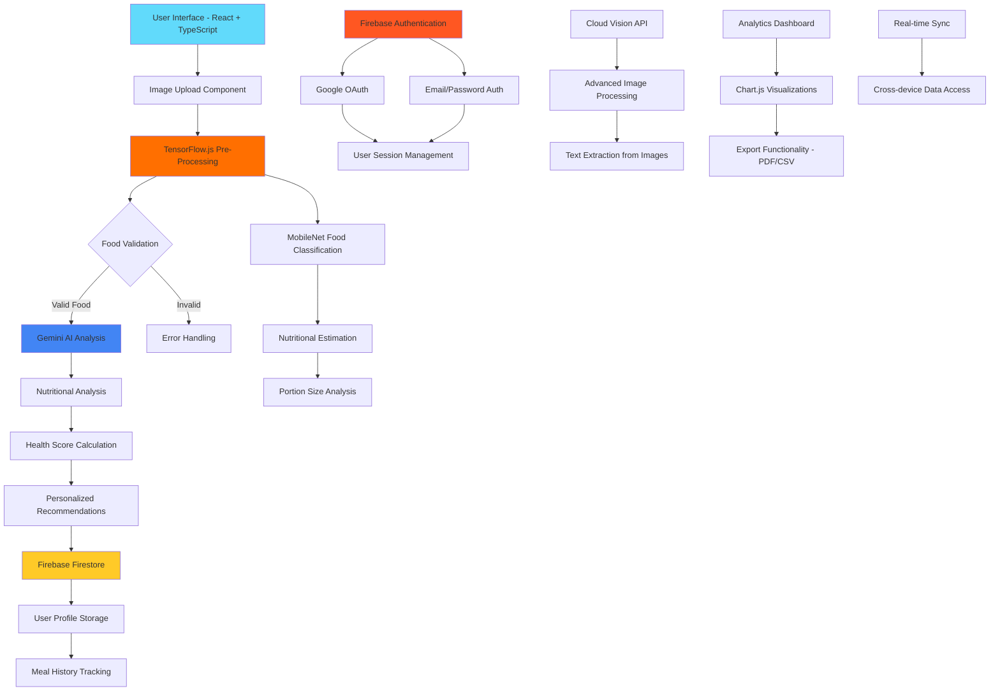

# Healthy Me - AI-Powered Nutrition Assistant

<div align="center">
  
  
  
  
  
  
</div>

## Overview

Healthy Me is an intelligent nutrition analysis platform that combines advanced artificial intelligence technologies to provide comprehensive dietary insights. The application leverages Google's Gemini AI for natural language processing and image analysis, TensorFlow.js for client-side machine learning, and Firebase for robust backend infrastructure. Built with modern web technologies, it delivers real-time nutritional analysis, personalized health recommendations, and comprehensive meal tracking capabilities.

## System Architecture



## Key Features

### AI-Powered Analysis Engine
- **Gemini AI Integration**: Advanced natural language processing for food identification and nutritional content extraction
- **TensorFlow.js Models**: Client-side machine learning using MobileNet for real-time food classification
- **Dual Validation System**: Combined AI validation ensures accurate food recognition and analysis
- **Real-time Processing**: Instant analysis with optimized performance for web browsers

### Comprehensive Health Assessment
- **Intelligent Scoring Algorithm**: Proprietary 1-20 scale health rating system based on nutritional content
- **Color-coded Classification**: Visual health indicators (Excellent, Good, Fair, Poor) for quick assessment
- **Personalized Recommendations**: Context-aware suggestions based on user health profile and dietary restrictions
- **Medical Condition Awareness**: Tailored advice for users with specific health conditions

### Advanced Data Management
- **Firebase Authentication**: Secure multi-provider authentication system supporting Google OAuth and email/password
- **Cloud Firestore Database**: Real-time NoSQL database with automatic synchronization across devices
- **Comprehensive User Profiles**: Storage of dietary preferences, medical conditions, BMI data, and health goals
- **Historical Tracking**: Complete meal history with searchable and filterable analytics

### Professional User Interface
- **Responsive Design**: Optimized experience across desktop, tablet, and mobile devices
- **Interactive Analytics Dashboard**: Dynamic charts and visualizations using Chart.js
- **Export Capabilities**: PDF and CSV export functionality for meal data and reports
- **Modern Design System**: Clean, accessible interface built with Tailwind CSS

## Technology Stack

### Frontend Architecture
- **React 19+**: Modern functional components with hooks and concurrent features
- **TypeScript 5.8+**: Static type checking for enhanced development experience and code reliability
- **Vite 6.2+**: Next-generation build tool providing fast development server and optimized production builds
- **Tailwind CSS**: Utility-first CSS framework for responsive and maintainable styling

### Artificial Intelligence & Machine Learning
- **Google Gemini AI**: State-of-the-art multimodal AI for image analysis and natural language processing
- **TensorFlow.js 4.22+**: Client-side machine learning framework for real-time food classification
- **MobileNet Model**: Pre-trained convolutional neural network optimized for mobile and web deployment
- **Custom ML Pipeline**: Integrated validation and analysis workflow combining multiple AI services

### Backend Infrastructure
- **Firebase Authentication**: Comprehensive authentication service supporting multiple providers
- **Cloud Firestore**: Scalable NoSQL document database with real-time synchronization
- **Firebase Storage**: Secure file storage solution for image assets and user uploads
- **Firebase Hosting**: Global CDN and hosting platform for web applications

### Data Visualization & Export
- **Chart.js 4.5+**: Flexible charting library for interactive data visualization
- **React Chart.js 2**: React wrapper for Chart.js with TypeScript support
- **jsPDF 3.0+**: Client-side PDF generation for report exports
- **html2canvas 1.4+**: HTML to canvas conversion for visual content capture

### Development & Build Tools
- **Vite**: Fast development server with hot module replacement and optimized bundling
- **TypeScript Compiler**: Advanced type checking and code transformation
- **ES Modules**: Modern JavaScript module system for efficient code organization

## Installation and Setup

### Prerequisites

Ensure the following software is installed on your development machine:

- **Node.js** (version 18.0 or higher) - [Download](https://nodejs.org/)
- **npm** (comes with Node.js) or **yarn** package manager
- **Git** for version control
- **Google Account** for Firebase console access and Gemini AI API key

### Quick Start Guide

#### 1. Repository Setup

```bash
git clone https://github.com/Anubhavick/Healthy-Me.git
cd ai-diet-scanner
```

#### 2. Dependency Installation

```bash
npm install
```

#### 3. Environment Configuration

Create a `.env.local` file in the project root directory with the following variables:

```env
# Firebase Configuration
VITE_FIREBASE_API_KEY=your_firebase_api_key
VITE_FIREBASE_AUTH_DOMAIN=your_project.firebaseapp.com
VITE_FIREBASE_PROJECT_ID=your_project_id
VITE_FIREBASE_STORAGE_BUCKET=your_project.firebasestorage.app
VITE_FIREBASE_MESSAGING_SENDER_ID=your_sender_id
VITE_FIREBASE_APP_ID=your_app_id
VITE_FIREBASE_MEASUREMENT_ID=your_measurement_id

# Gemini AI Configuration
VITE_GEMINI_API_KEY=your_gemini_api_key

# Cloud Vision API (Optional)
VITE_GOOGLE_CLOUD_VISION_API_KEY=your_cloud_vision_api_key
```

**Security Note**: Never commit environment files to version control. The `.env.local` file is automatically ignored by git.

#### 4. Development Server

```bash
npm run dev
```

The application will be available at `http://localhost:5173`

## Configuration Guide

### Firebase Setup

1. **Create Firebase Project**
   - Navigate to [Firebase Console](https://console.firebase.google.com/)
   - Create a new project with Google Analytics enabled
   - Note the project configuration details

2. **Authentication Configuration**
   - Enable Google and Email/Password authentication providers
   - Configure OAuth consent screen for Google authentication
   - Add authorized domains for production deployment

3. **Firestore Database Setup**
   - Create Firestore database in production mode
   - Configure security rules for user data protection
   - Set up collections for user profiles and meal history

4. **Storage Configuration**
   - Initialize Firebase Storage for image uploads
   - Configure CORS settings for web access
   - Set up security rules for file access control

### Gemini AI Configuration

1. **API Key Generation**
   - Visit [Google AI Studio](https://makersuite.google.com/app/apikey)
   - Generate a new API key for Gemini AI access
   - Configure usage quotas and rate limiting

2. **Service Integration**
   - The application automatically configures Gemini AI services
   - Image analysis and text generation capabilities are enabled by default
   - Custom prompts are optimized for nutritional analysis

## Project Structure

```
ai-diet-scanner/
├── public/                          # Static assets and public files
├── src/
│   └── vite-env.d.ts               # Vite environment type definitions
├── components/                      # React component library
│   ├── AIServicesStatus.tsx        # AI service monitoring component
│   ├── AnalysisResult.tsx          # Nutritional analysis display
│   ├── AnalyticsDashboard.tsx      # Data visualization dashboard
│   ├── AuthContext.tsx             # Authentication context provider
│   ├── AuthModal.tsx               # User authentication interface
│   ├── BMICalculator.tsx           # Body Mass Index calculator
│   ├── DietSelector.tsx            # Dietary preference selector
│   ├── EnhancedAnalytics.tsx       # Advanced analytics features
│   ├── EnhancedAnalyticsModal.tsx  # Modal for detailed analytics
│   ├── FirebaseSync.tsx            # Firebase synchronization component
│   ├── GoalsStreaksModal.tsx       # Goals and streaks management
│   ├── icons.tsx                   # Icon component library
│   ├── ImageUploader.tsx           # Image upload and processing
│   ├── MealHistory.tsx             # Historical meal tracking
│   ├── MealHistoryModal.tsx        # Detailed meal history view
│   ├── MedicalConditionsSelector.tsx # Health condition selection
│   ├── ShareCardGenerator.tsx      # Social sharing card creation
│   ├── SocialSharing.tsx           # Social media integration
│   ├── StreakGoals.tsx             # Goal tracking and streaks
│   └── UserProfileSetup.tsx        # User profile configuration
├── services/                        # Backend service integrations
│   ├── cloudVisionService.ts       # Google Cloud Vision API service
│   ├── enhancedGeminiService.ts    # Advanced Gemini AI integration
│   ├── exportService.ts            # Data export functionality
│   ├── firebase.ts                 # Firebase configuration
│   ├── firebaseService.ts          # Firebase database operations
│   ├── geminiService.ts            # Gemini AI service integration
│   └── tensorflowService.ts        # TensorFlow.js model management
├── App.tsx                         # Main application component
├── constants.ts                    # Application constants and configuration
├── index.html                      # HTML entry point
├── index.tsx                       # React application entry point
├── metadata.json                   # Application metadata
├── package.json                    # Project dependencies and scripts
├── tsconfig.json                   # TypeScript configuration
├── types.ts                        # TypeScript type definitions
├── vite.config.ts                  # Vite build configuration
└── README.md                       # Project documentation
```

## Core Functionality

### AI Analysis Workflow

1. **Image Preprocessing**: TensorFlow.js validates and preprocesses uploaded images
2. **Dual AI Analysis**: Parallel processing with Gemini AI and TensorFlow models
3. **Food Classification**: MobileNet model identifies food items with confidence scores
4. **Nutritional Analysis**: Gemini AI extracts detailed nutritional information
5. **Health Assessment**: Custom algorithm calculates comprehensive health scores
6. **Data Persistence**: Results stored in Firestore with user authentication
7. **Real-time Sync**: Automatic synchronization across all user devices

### Authentication and User Management

1. **Multi-provider Authentication**: Support for Google OAuth and email/password
2. **Profile Creation**: Comprehensive user profile setup including health information
3. **Session Management**: Persistent authentication with automatic token refresh
4. **Data Security**: Firestore security rules ensure user data privacy
5. **Cross-device Synchronization**: Real-time data sync across multiple devices

## Development Commands

```bash
# Development server with hot module replacement
npm run dev

# Production build with optimization
npm run build

# Preview production build locally
npm run preview

# TypeScript type checking
npx tsc --noEmit

# Project dependency analysis
npm audit
```

## Deployment

### Firebase Hosting

1. **Install Firebase CLI**
   ```bash
   npm install -g firebase-tools
   firebase login
   ```

2. **Initialize and Configure**
   ```bash
   firebase init hosting
   # Select existing Firebase project
   # Configure build directory as 'dist'
   # Configure as single-page application
   ```

3. **Build and Deploy**
   ```bash
   npm run build
   firebase deploy
   ```

### Alternative Deployment Platforms

- **Vercel**: Automatic deployment from GitHub repository with zero configuration
- **Netlify**: Drag-and-drop deployment or Git integration with build automation
- **GitHub Pages**: Static site hosting with GitHub Actions for CI/CD

## Security and Performance

### Security Implementation
- **Environment Variable Protection**: All sensitive credentials stored securely in environment files
- **Firebase Security Rules**: Granular access control for user data and file storage
- **Input Validation**: Comprehensive sanitization of user inputs and file uploads
- **HTTPS Enforcement**: Secure data transmission with SSL/TLS encryption
- **Authentication Token Management**: JWT-based session handling with automatic renewal
- **CORS Configuration**: Proper cross-origin resource sharing for API access

### Performance Optimizations
- **Code Splitting**: Dynamic imports for reduced initial bundle size
- **Image Optimization**: Automatic compression and format conversion for uploaded images
- **Model Caching**: TensorFlow.js model caching for improved subsequent load times
- **CDN Integration**: Firebase CDN for global asset delivery
- **Lazy Loading**: Component-level lazy loading for enhanced user experience
- **Build Optimization**: Vite-powered bundling with tree shaking and minification

## Contributing

We welcome contributions from the community. Please follow these guidelines:

### Development Workflow

1. **Fork the Repository**
   ```bash
   # Fork the repository on GitHub
   git clone https://github.com/YOUR_USERNAME/ai-diet-scanner.git
   cd ai-diet-scanner
   ```

2. **Create Feature Branch**
   ```bash
   git checkout -b feature/your-feature-name
   ```

3. **Development Setup**
   ```bash
   npm install
   # Configure environment variables
   npm run dev
   ```

4. **Code Standards**
   - Follow TypeScript best practices
   - Maintain consistent code formatting
   - Write comprehensive component documentation
   - Include unit tests for new functionality

5. **Commit and Push**
   ```bash
   git add .
   git commit -m "feat: add your feature description"
   git push origin feature/your-feature-name
   ```

6. **Create Pull Request**
   - Provide detailed description of changes
   - Include screenshots for UI modifications
   - Reference related issues if applicable

### Code Review Process

- All pull requests require review before merging
- Automated testing must pass before approval
- Code coverage requirements must be maintained
- Documentation updates required for API changes

## Contributors

<table>
  <tr>
    <td align="center">
      <a href="https://github.com/Anubhavick">
        
        <br />
        <sub><b>Anubhav Mishra</b></sub>
      </a>
      <br />
      <sub>Project Lead & Full-stack Developer</sub>
    </td>
  </tr>
</table>

*We appreciate all contributors who help improve this project. If you'd like to contribute, please see our contributing guidelines above.*

## License

This project is licensed under the MIT License - see the [LICENSE](LICENSE) file for complete details.

**MIT License Summary**: You are free to use, copy, modify, merge, publish, distribute, sublicense, and/or sell copies of the software, subject to the following conditions:
- Include the original copyright notice and license in all copies
- The software is provided "as is" without warranty of any kind

## Support and Documentation

### Getting Help

- **Issues**: Report bugs or request features via [GitHub Issues](https://github.com/Anubhavick/ai-diet-scanner/issues)
- **Discussions**: Join community discussions for general questions and feature requests
- **Documentation**: Comprehensive API documentation available in the `/docs` directory

### Troubleshooting

Common issues and solutions:

1. **Environment Variables Not Loading**
   - Ensure `.env.local` file exists in project root
   - Verify all required variables are defined
   - Restart development server after changes

2. **Firebase Configuration Errors**
   - Check Firebase project settings and API keys
   - Verify authentication providers are enabled
   - Ensure Firestore rules are properly configured

3. **TensorFlow.js Model Loading Issues**
   - Check internet connection for CDN access
   - Clear browser cache and local storage
   - Verify compatible browser version

## Acknowledgments

This project leverages several outstanding technologies and services:

- **Google AI Team** for Gemini API and advanced AI capabilities
- **Firebase Team** for comprehensive backend infrastructure
- **TensorFlow Team** for machine learning framework and models
- **React Team** for the robust frontend framework
- **Open Source Community** for countless libraries and tools that make this project possible

---

<div align="center">
  <p><strong>Built with modern web technologies by <a href="https://github.com/Anubhavick">Anubhav Mishra</a></strong></p>
  <p>If this project helps you, please consider giving it a star on GitHub</p>
</div>
